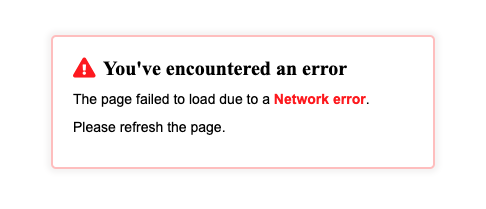

# network-request
This project was inspired by a [Tania Rascia article](https://www.taniarascia.com/how-to-connect-to-an-api-with-javascript/) I had read that was still fresh in my mind. The project consumes data from [this Studio Ghibli API](https://ghibliapi.herokuapp.com/#section/Helper-Libraries/Elixir), which makes learning about APIs less daunting and more fun. This was the first piece of content I read that helped me understand what an API is and how to interact with it. I wanted to create my own version using promises.

Since network requests can sometimes fail, I've programmed the request so that it sometimes does just that:
```
const networkRequest = (callback) => {
    let failureRate = Math.floor(Math.random() * 10);
    if (failureRate < 5) {
      setTimeout(() => {
        callback(fetch("https://ghibliapi.herokuapp.com/films"));
      }, 10);
    }
  };
```

The user is informed of any possible network errors:



If there are no errors, the data returned from the API is used to render the frontend:


